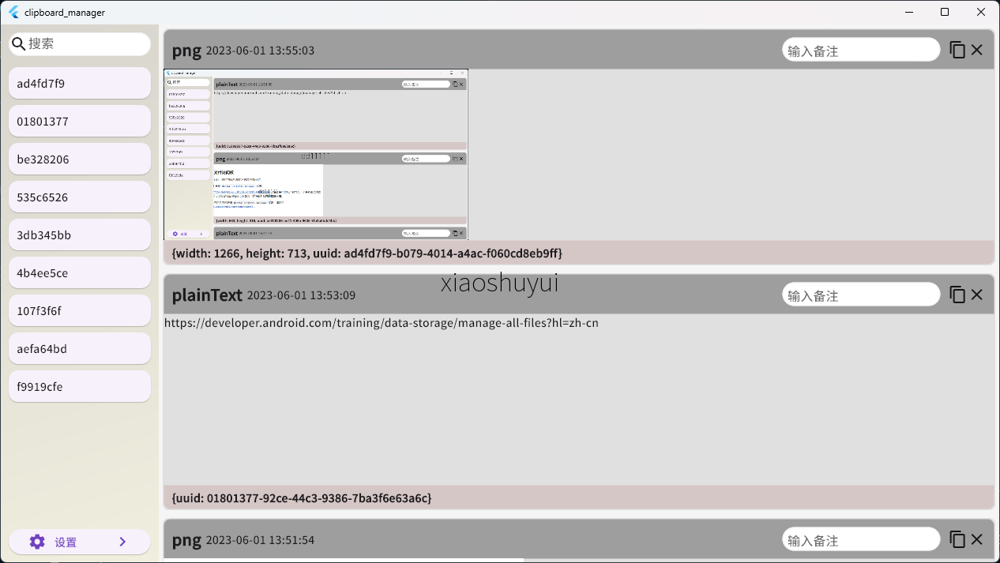
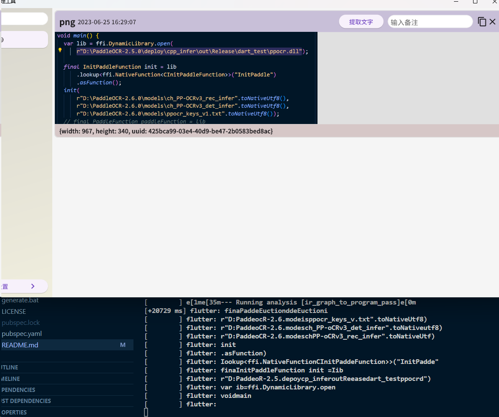

# clipboard_manager

## changelogs

* 0.5.0 接入了paddle ocr（WIP）
  
  
  
* 0.4.1 locale 持久化

* 0.4.0 i18n

* 0.3.0 支持更改水印文字（英文和数字）

* 0.2.0 增加备注与搜索功能

* 0.1.2 复制图像的时候自动添加水印（WIP）

* 0.1.1 优化样式

* 0.1.0 初始化项目
